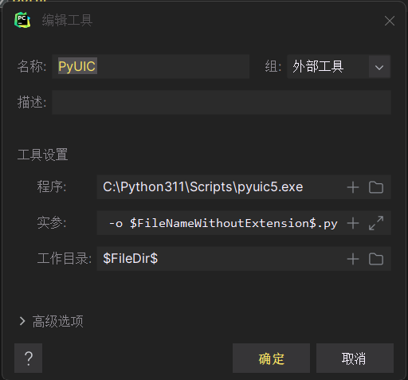
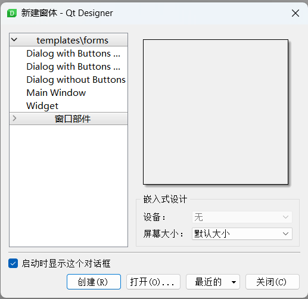
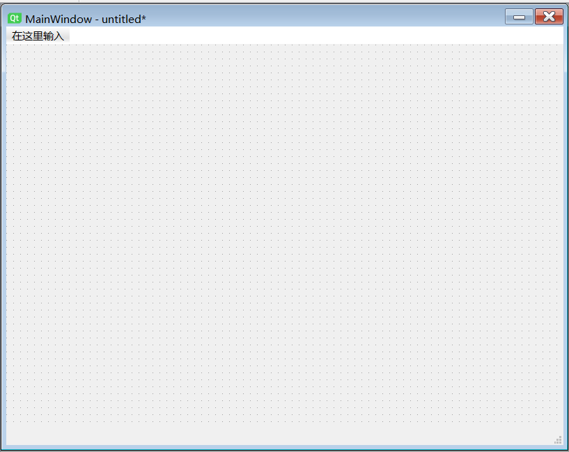
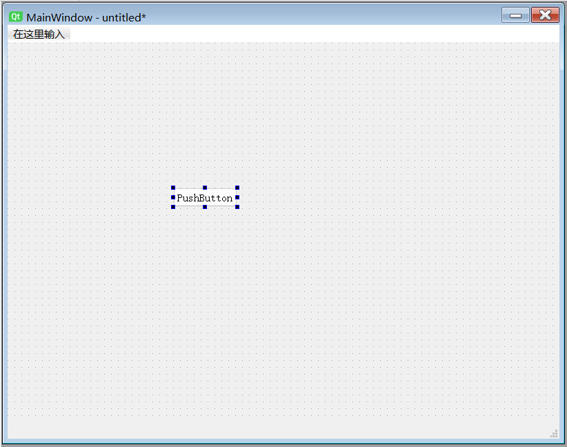
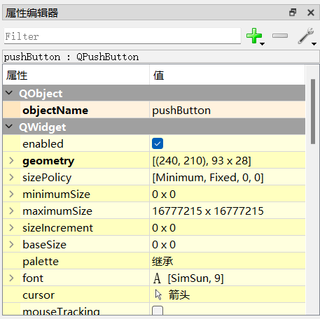
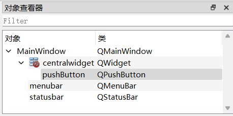

##  PYQT开发指南
### 安装PyQt
+ 通过pip3安装pyqt5和pyqt5-tools, 命令: pip install PyQt5 和 pip install pyqt5-tools
+ 把python安装目录下\Lib\site-packages\pyqt5_tools这个文件夹加到系统环境变量里
  
+ 找到QT Designer, 在python安装目录下\Lib\site-packages\qt5_applications\Qt\bin\designer.exe

### 设置工具
+ 在pycharm中添加designer和PyUIC工具: 
1. 找到PyCharm -> 文件 -> 设置 -> 工具 -> 外部工具
   
2. 点左上角+号添加工具
3. 首先添加QT Designer: 
   **名称**: 可以自定义;
   实参留空
   **程序**: 把designer.exe的绝对路径填进去;
   **工作目录**: 看自己喜好, 一般用宏\$FileDir\$
   
4. 然后添加PyUIC:
   名称自己填;
   **程序**: 是pyuic5.exe的目录, 一般是python安装路径下\Scripts\pyuic5.exe
   **实参**: `$FileName$ -o $FileNameWithoutExtension$.py`, 意思是由.ui文件在文件所在目录生成一个同文件名的.py文件
   **工作目录**: 同上\$FileDir\$
   
5. 完成

### 使用QT Designer开发的基本顺序
1. 使用designer应用程序把界面(包括按钮、窗口、输入框等等)设计好, 得到一个.ui文件
2. 使用PyUIC将.ui转换为.py文件以便调用, 编写各种控件运行的逻辑
3. 新建一个main.py(名字自定, 但是一定要新建一个, 不要在刚刚生成的.py里面直接写)
4. 在新建的main.py中, 一定要引入如下包:
   ```python
   import sys
   from PyQt5 import QtCore, QtGui, QtWidgets
   import xxx.py  # 这里的xxx就是刚刚生成的.py, 如果有多个要全部import进来
   ```
5. 在main.py中编写控制控件的代码
   
### 使用Designer设计界面的基本操作
1. 打开designer, 会弹出一个窗口, 这是用来新建一个窗体的(类似平时软件的弹窗那种)
   
   templates/forms五个选项: 带**横向**分布按钮的对话框、带**纵向**分布按钮的对话框、没按钮的对话框、主窗体、部件
   **这里5个窗体都是类的对象**, 前三个是QDialog类的对象, 主窗体是QMainWindow类的对象, 部件是QWidget类的对象
   按钮后续都是可以摆上的, 所以前4个区别不大, 只是写代码的时候要注意所属类不一样

2. 比如现在新建了一个主窗体.
   
   左侧一列是部件列表, 就是所有可以放到设计的界面里的部件汇总, 要添加哪一个就把哪一个用鼠标拖到你要创建的位置
   

3. 拖入一个push button的效果:
   
   就像PS一样, 拉动蓝点改大小, 双击按钮里面的字设置按钮文本

4. 在右侧的属性编辑器, 可以更改这个push button的objectName("对象名字")和其他属性.
   
   因为是类的对象, 任何一个部件都有属性, 属性可以在designer中更改, 也可以在写代码的时候通过一系列setxxxx方法更改
   对于部件来说, setxxxx方法通常是它的属性
   **按照1中说的, 这个push_button是QWidget类的对象, 更详细地, 是QPushButton类(QWidget类的子类)的对象, 在"对象查看器"中可以看到**
   

### 写main.py时的基础内容
1. main.py作为程序入口, 开头的程序内容基本是固定的.
   ```python
   import sys
   from PyQt5 import QtCore, QtGui, QtWidgets
   import xxxxxx

   if __name__ == '__main__':
      # 创建应用程序对象
      app = QtWidgets.QApplication(sys.argv)

      # 创建QMainWindow的对象, 是一个窗体
      Main = QtWidgets.QMainWindow()
      # 调用从.ui生成的.py文件里的方法生成UI对象(所有部件都可以看做是这个对象的属性)
      UI = switch_page_test.Ui_MainWindow()
      # 表示UI里的部件在Main对象对应的窗体里
      UI.setupUi(Main)

      # 显示创建的窗格
      Main.show()
      ...
      ... # 这里就是写其他代码的地方
      ...
      # 程序出口
      sys.exit(app.exec())
   ```

### 让部件控制界面切换等动作
1. PyQt有"信号"和"槽"的概念. **信号**当按钮等部件发生"被按下"等动作时会发出, 而**槽**是一系列函数, 用来连接发出的信号
   
2. 以push button按钮为例, 当被按下时发送clicked, 我们可以定义如下的槽函数:
   ```python
   def show_text():
      # textBrowser是一个显示文本的框, 方法setText是用来设置显示内容的
      UI.textBrowser.setText("Button is clicked.")
   ```

3. 然后连接信号clicked和槽show_text:
   ```python
   # 任何信号都有connect方法, 以槽作为参数连接二者. 注意槽不要后面带括号, 否则就直接运行槽函数了
   UI.pushButton.clicked.connect(show_text)
   ```